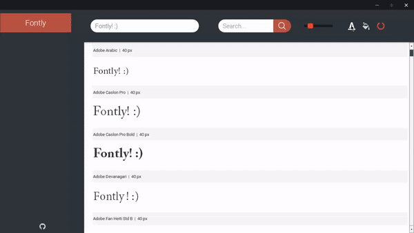
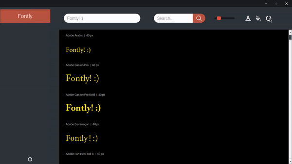
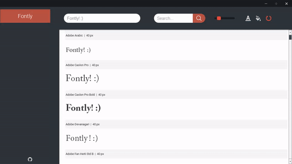
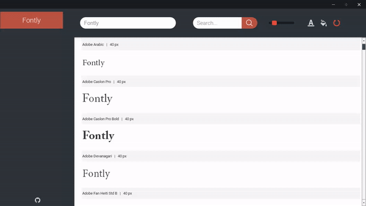

<h1 align="center"></h1>
<h2 align="center"><b>Fontly</b></h2>
<h4 align="center">Fontly helps to choose the best font for your next project. It shows all available local fonts in the list which is fully customizable</h4>

#### Features

* Shows up every font locally installed on your machine by creating scrollable list
* Has customizing functions such as text color, background color and text size
* You can easily change text displaying in the list
* Has search function to make you find your favourites fonts much easier

#### Install

1. <a href="http://www.mediafire.com/file/wzhb5u9uq44caeq/Fontly+Installer.exe">Download installer by clicking at this link</a>
2. Run Fontly Installer
3. Enjoy

#### Examples

There's some preview of Fontly in action.

Give your font a perfect shade! | Don't be afraid of messing up with settings. Resetting them is nothing but pressing a button!
:----------------------------:|:----------------------------:
 | 

Find what you like! | Express yourself with this amazing text presence changer!
:----------------------------:|:----------------------------:
 | 
